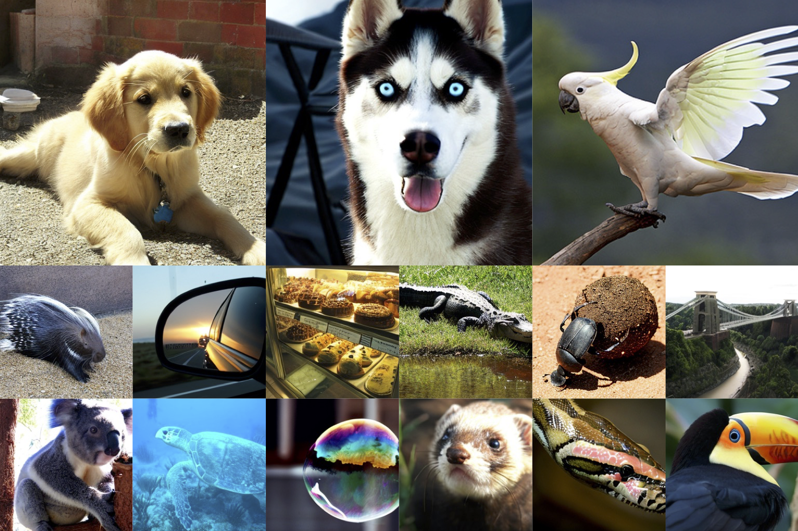

# Critical Multitask Batch Sizes in Diffusion Models<br>



This repo explores the training dynamics of diffusion models by investigating critical batch sizes in multitask scenarios. The methodology is inspired by the theory proposed in ["An Empirical Model of Large-Batch Training"](https://arxiv.org/abs/1812.06162), which provides insights into optimal batch sizes for deep neural networks. However, this framework does not directly account for multitask cases, such as diffusion models, where each timestep (or range of timesteps) can be treated as a distinct task.

## Understanding Critical Batch Size and Gradient Noise Scale

In large-batch training, **critical batch size (B_crit)** and **gradient noise scale (GNS)** are closely related concepts that dictate the efficiency of training. The gradient noise scale provides an estimate of how large a batch size can be before diminishing returns occur. Specifically:

- **GNS (Gradient Noise Scale):** Measures the variance in gradients across training examples. A higher GNS indicates that a larger batch size can be used efficiently.
- **B_crit (Critical Batch Size):** Defined as the batch size where training efficiency starts to decline significantly. It marks the transition from an efficient to an inefficient parallelization regime.

In diffusion models, which involve multitask learning across timesteps, GNS varies across different timestep bins. This means that the optimal batch size for each timestep can change dynamically during training, requiring adaptive strategies for efficient batch allocation.

## Application to Diffusion Models

To bridge this gap, we examine how the concepts of critical batch size can be applied to diffusion model training. Specifically, this study focuses on analyzing critical batch sizes across multiple timestep bins and how these change over the course of training. The goal is to determine whether this understanding can lead to more efficient training strategies for diffusion models, building upon insights such as those presented in ["Efficient Diffusion Training via Min-SNR Weighting Strategy"](https://arxiv.org/abs/2303.09556).

This repo serves as a baseline exploration, providing a foundation for improving the efficiency of diffusion model training through an understanding of multitask batch size dynamics.

## Repository Contents

It contains:

* 📜 **fast-DiT**: Using ["fast-DiT"](https://github.com/chuanyangjin/fast-DiT) to train the model.
* 🪐 **A Gradient Noise Scale Calculator**: Includes the [implementation](GNS.py) and a [collection of helper functions](gns_utils.py) to support GNS calculation and related experiments.
* ⚡️ **Pre-trained DiT-S/2 Models**: High-quality models trained on ImageNet, available for initialization and reproducibility.
* 📂 **Checkpoints Directory**: Contains pre-trained [DiT-S/2 model checkpoints](checkpoints), organized by training configuration and purpose.
* 🛸 **Dataset**: The [ILSVRC2012_validation](data) dataset is used to calculate gradients for evaluating the gradient noise scale (GNS).
  

## Setup

First, download and set up the repo:

```bash
git clone https://github.com/Longzz0824/Critical-Multitask-Batch-Sizes-in-Diffusion-Models.git
cd DiT
```

We provide an [`environment.yml`](environment.yml) file that can be used to create a Conda environment. If you only want 
to run pre-trained models locally on CPU, you can remove the `cudatoolkit` and `pytorch-cuda` requirements from the file.

```bash
conda env create -f environment.yml
conda activate DiT  
```

## Training
### Preparation Before Training
To extract ImageNet features with `1` GPUs on one node:

```bash
torchrun --nnodes=1 --nproc_per_node=1 extract_features.py --model DiT-S/2 --data-path /data --features-path /features
```

### Training DiT
Fast-DiT provide a training script for DiT in [`train.py`](train.py). This script can be used to train class-conditional 
DiT models, but it can be easily modified to support other types of conditioning. 

To launch DiT-S/2 (256x256) training with `1` GPUs on one node:

```bash
accelerate launch --mixed_precision fp16 train.py --model DiT-S/2 --features-path /path/to/store/features
```

To launch DiT-XL/2 (256x256) training with `N` GPUs on one node:
```bash
accelerate launch --multi_gpu --num_processes N --mixed_precision fp16 train.py --model DiT-S/2 --features-path /path/to/store/features
```

Alternatively, you have the option to extract and train the scripts located in the folder [training options](train_options).


## GNS calculation
To calculate the Gradient Noise Scale (GNS) for a specific checkpoint, you can use the following command:

```bash
TODO1
```


## Experiment 1: Changes in Critical batch size (B_crit) During DiT Training

The first experiment investigates the dynamics of the **Gradient Noise Scale (GNS)** during the training process of a Diffusion Transformer (DiT). GNS, as introduced in ["An Empirical Model of Large-Batch Training"](https://arxiv.org/abs/1812.06162), is a critical metric for understanding the relationship between batch size and training efficiency. It helps identify the **critical batch size**, the point at which increasing the batch size yields diminishing returns in terms of gradient noise reduction.

### Objective
This experiment aims to analyze how the **Gradient Noise Scale (GNS)** evolves throughout the training process of a **Diffusion Transformer (DiT)**. GNS, introduced in *"An Empirical Model of Large-Batch Training"*, is a crucial metric for understanding the relationship between batch size and training efficiency. Specifically, this study investigates:  

- The variation of **GNS at different training checkpoints** (e.g., 10%, 20%, ..., 100% of total training steps).  
- Whether **the critical batch size changes as training progresses**.  


### Implementation
```bash
TODO2
```

### Outcomes
TODO3- a graph of experiment 1


This experiment provides a foundation for optimizing batch size allocation across tasks, improving the overall efficiency of diffusion model training.


## Experiment 2: Analyzing B_crit Across Multiple Timestep Bins in Diffusion Models

In this experiment, we investigate the **Gradient Noise Scale (GNS)** across multiple timestep bins within diffusion models. Diffusion models inherently involve multitask training, as each timestep (or a range of timesteps) can be treated as a separate task. This experiment aims to explore how GNS varies across these timesteps and uncover potential inefficiencies in training specific ranges.

### Objective
- To partition the timesteps of a diffusion model into several bins and analyze the variation in GNS for each bin during training.
- To identify which timestep bins exhibit higher or lower gradient noise, revealing task-specific optimization challenges.
- To understand whether certain timesteps require different batch size allocations for efficient training.

### Implementation
```bash
TODO4
```

### Outcomes
TODO5- a graph of experiment 2

This experiment builds upon the first by introducing a finer granularity in analyzing training dynamics. The insights gained could pave the way for adaptive training strategies, improving the overall efficiency of diffusion model training.


