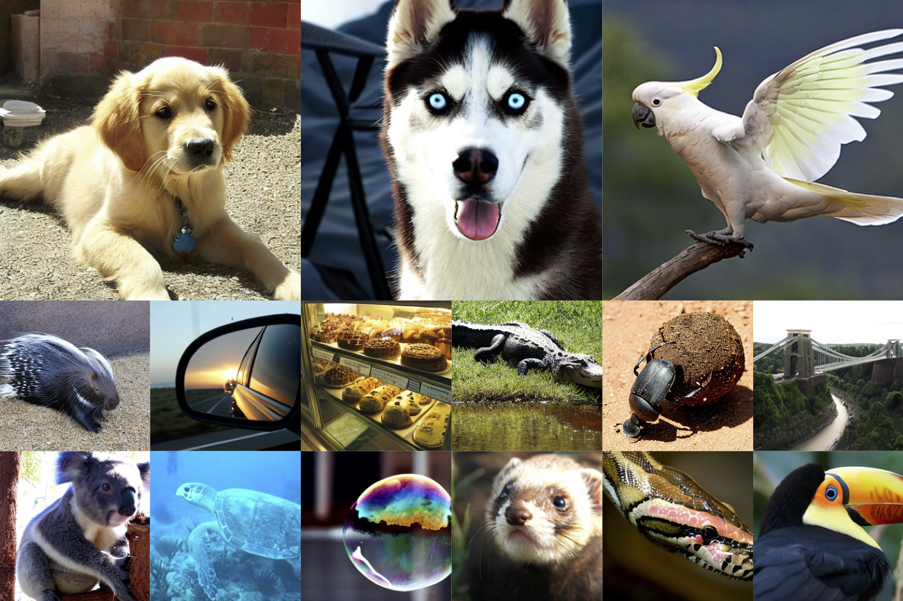

# Critical Multitask Batch Sizes in Diffusion Models<br>



This repo explores the training dynamics of diffusion models by investigating critical batch sizes in multitask scenarios. It uses ["fast-DiT"](https://github.com/chuanyangjin/fast-DiT) for training, which enhances efficiency and scalability in diffusion model training. The methodology is inspired by the theory proposed in ["An Empirical Model of Large-Batch Training"](https://arxiv.org/abs/1812.06162), which provides insights into optimal batch sizes for deep neural networks. However, this framework does not directly account for multitask cases, such as diffusion models, where each timestep (or range of timesteps) can be treated as a distinct task.

## Understanding Critical Batch Size and Gradient Noise Scale

In large-batch training, **critical batch size (B_crit)** and **gradient noise scale (GNS)** are closely related concepts that dictate the efficiency of training. The gradient noise scale provides an estimate of how large a batch size can be before diminishing returns occur. Specifically:

- **GNS (Gradient Noise Scale):** Measures the variance in gradients across training examples. A higher GNS indicates that a larger batch size can be used efficiently.
- **B_crit (Critical Batch Size):** Defined as the batch size where training efficiency starts to decline significantly. It marks the transition from an efficient to an inefficient parallelization regime.

In diffusion models, which involve multitask learning across timesteps, GNS varies across different timestep bins. This means that the optimal batch size for each timestep can change dynamically during training, requiring adaptive strategies for efficient batch allocation.

## Application to Diffusion Models

To bridge this gap, we examine how the concepts of critical batch size can be applied to diffusion model training. Specifically, this study focuses on analyzing critical batch sizes across multiple timestep bins and how these change over the course of training. The goal is to determine whether this understanding can lead to more efficient training strategies for diffusion models, building upon insights such as those presented in ["Efficient Diffusion Training via Min-SNR Weighting Strategy"](https://arxiv.org/abs/2303.09556).

This repo serves as a baseline exploration, providing a foundation for improving the efficiency of diffusion model training through an understanding of multitask batch size dynamics.

## Repository Contents

It contains:

* 📜 **fast-DiT**: Using ["fast-DiT"](https://github.com/chuanyangjin/fast-DiT) to train the model.
* 🪐 **A Gradient Noise Scale Calculator**: Includes the [implementation](GNS.py) and a [collection of helper functions](gns_utils.py) to support GNS calculation and related experiments.
* 🔥 **Some Experiments**: All experiment scripts and results are stored in the `gns_experiments/` folder. This folder contains code and logs for analyzing **Gradient Noise Scale (GNS) dynamics** in diffusion models.
* ⚡️ **Pre-trained DiT-S/2 Models**: High-quality models trained on ImageNet, available for initialization and reproducibility.
* 📂 **Checkpoints Directory**: Contains pre-trained [DiT-S/2 model checkpoints](checkpoints), organized by training configuration and purpose.
* 🛸 **Dataset**: The [ILSVRC2012_validation](data) dataset is used to calculate gradients for evaluating the gradient noise scale (GNS).
  

## Setup

First, download and set up the repo:

```bash
git clone https://github.com/Longzz0824/Critical-Multitask-Batch-Sizes-in-Diffusion-Models.git
cd DiT
```

We provide an [`environment.yml`](environment.yml) file that can be used to create a Conda environment. If you only want 
to run pre-trained models locally on CPU, you can remove the `cudatoolkit` and `pytorch-cuda` requirements from the file.

```bash
conda env create -f environment.yml
conda activate DiT  
```

To install Jupyter and required dependencies:

```bash
pip install jupyterlab
```

## Training
### Preparation Before Training
To extract ImageNet features with `1` GPUs on one node:

```bash
torchrun --nnodes=1 --nproc_per_node=1 extract_features.py --model DiT-S/2 --data-path /data --features-path /features
```

### Training DiT
Fast-DiT provide a training script for DiT in [`train.py`](train.py). This script can be used to train class-conditional 
DiT models, but it can be easily modified to support other types of conditioning. 

To launch DiT-S/2 (256x256) training with `1` GPUs on one node:

```bash
accelerate launch --mixed_precision fp16 train.py --model DiT-S/2 --features-path /path/to/store/features
```

To launch DiT-S/2 (256x256) training with `N` GPUs on one node:
```bash
accelerate launch --multi_gpu --num_processes N --mixed_precision fp16 train.py --model DiT-S/2 --features-path /path/to/store/features
```

Alternatively, you have the option to extract and train the scripts located in the folder [training options](train_options).


## Running Experiments in Jupyter Notebook
Once inside the project folder, start Jupyter:
```bash
jupyter notebook
```
This will open a browser-based interface. Navigate to the gns_experiments/ folder and open the relevant experiment .ipynb file.


## Experiment 1: Exploring the Dependence of Average GNS on Real Gradient Accuracy
In this experiment, different true_portion ratios were chosen to calculate the Real gradient.

### Objective
- Exploring the Dependence of Average GNS on Real Gradient Accuracy

### Outcomes

- **GNS increases as G_true accuracy improves**, suggesting that a higher proportion of accurate gradients leads to greater gradient noise scale (GNS).
- **Linear growth pattern**, indicating a direct correlation between `true_portion` and estimated GNS (`gns_est`).  


## Experiment 2: Hyperparameter Search
In this experiment, we aim to explore the impact of hyperparameters on the estimation of GNS. ["An Empirical Model of Large-Batch Training"](https://arxiv.org/abs/1812.06162) proposes a method to calculate Unbiased Estimate of GNS  The goal is to determine how different values of **small batch size (𝑏)**, **big batch size (𝐵)**, and **repetitions (𝑟𝑒𝑝𝑠)** affect both the performance and accuracy of the estimation. By systematically searching through different hyperparameter settings, we seek to identify an optimal configuration that balances computational efficiency with estimation correctness.
### Objective
- This experiment aims to analyze how to find optimal parameters **(b, B, reps)** for estimating GNS in terms of performance/correctness.

### Outcomes
This figure illustrates the estimated GNS (Gradient Noise Scale) distribution during training for different combinations of small batch size (b) and big batch size (B), analyzing the impact of these hyperparameters on GNS estimation and its trend over training steps.


The figure below compares the runtime and estimated GNS (Gradient Noise Scale) for different numbers of repetitions (reps = 2 and reps = 5), showing the trade-off between computation time and GNS estimation stability. The runtime increases as batch size grows, while GNS estimation stabilizes with more repetitions.


## Experiment 3: Analyzing GNS Across Multiple Timestep Bins in Diffusion Models

In this experiment, we investigate the **Gradient Noise Scale (GNS)** across multiple timestep bins within diffusion models. Diffusion models inherently involve multitask training, as each timestep (or a range of timesteps) can be treated as a separate task. This experiment aims to explore how GNS varies across these timesteps and uncover potential inefficiencies in training specific ranges.

### Objective
- To partition the timesteps of a diffusion model into several bins and analyze the variation in GNS for each bin during training.
- To identify which timestep bins exhibit higher or lower gradient noise, revealing task-specific optimization challenges.

### Outcomes

- **GNS increases over training**, with different timestep bins exhibiting varying growth patterns.  
- Some bins (e.g., **(0,100)** and **(101,200)**) show **sharp increases**, indicating noisier gradients in early timesteps.  
- **Later bins (e.g., (901,1000)) have lower GNS**, suggesting more stable optimization at later stages.  
- **Adaptive batch size strategies** could enhance training efficiency by adjusting to timestep-specific GNS trends.  


## Experiment 4: Estimating Critical Batch Size over Training Steps

The last experiment investigates the dynamics of the **Critical Batch Size (B_crit)** during the training process of a Diffusion Transformer (DiT).

### Objective
This experiment aims to analyze how the **Gradient Noise Scale (GNS)** evolves throughout the training process of a **Diffusion Transformer (DiT)**. GNS, introduced in *"An Empirical Model of Large-Batch Training"*, is a crucial metric for understanding the relationship between batch size and training efficiency. Specifically, this study investigates:  

- Estimate the multi-task *critical batch sizes** (dependent on time-bins) from GNS computation
- Estimate throughout training steps 


### Outcomes


- **Critical batch size (B_crit) varies over training**
- **Gradient Noise Scale (GNS) decreases for later timesteps**, indicating more stable gradients at higher timestep ranges.


## Summary of Findings
Through a series of experiments, we analyzed **Gradient Noise Scale (GNS)** dynamics and **critical batch size (B_crit)** in diffusion models. The results provide valuable insights into how batch size, timestep variation, and gradient estimation accuracy influence training efficiency.

1. **GNS is dependent on gradient accuracy**  
   - Experiments show **GNS increases as G_true accuracy improves**, indicating that **more accurate gradients introduce greater noise variations**.  
   - This suggests **larger batch sizes may be necessary for higher accuracy models** to maintain stable training.  

2. **GNS varies significantly across timesteps**  
   - Early timesteps (**0-100, 101-200**) consistently exhibit **higher GNS**, requiring **larger batch sizes** for stable training.  
   - Later timesteps show lower GNS, suggesting they benefit from **smaller batch sizes** for efficient computation.  

3. **Critical batch size (B_crit) evolves during training**  
   - **B_crit increases as training progresses**, particularly in earlier timesteps.  
   - **Implication:** Static batch size allocation is **inefficient**, and an **adaptive batch size strategy** could significantly improve training efficiency.


